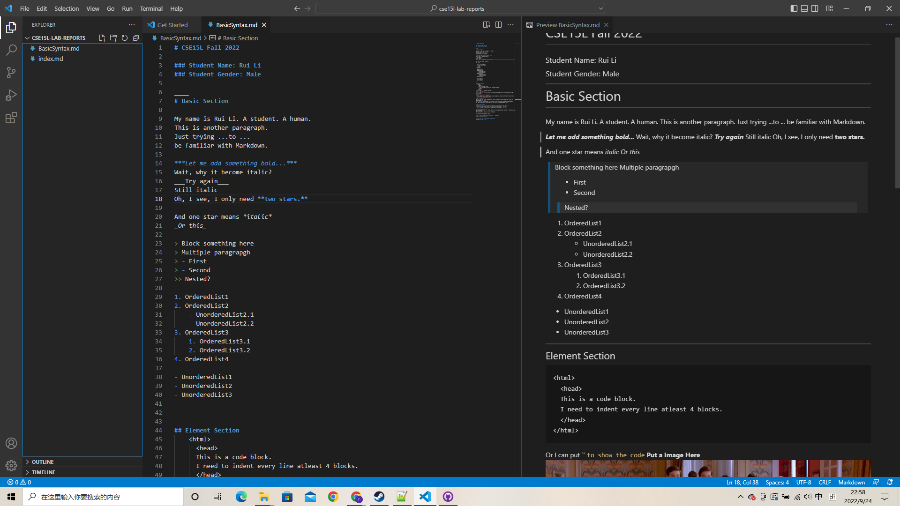

# Hello World!

My name is Rui Li. 

There are some basic syntax practice for Markdown in another file

Here is the [LINK](BasicSyntax.md "Na Na Na Na Na Na Na")

And there is a screenshot:

---

**The Link to Some Pages**

[WEEK 0](https://ucsd-cse15l-f22.github.io/week/week0/ "Not Bad")

[My Github Main Page](https://ruili4ucsd.github.io/cse15l-lab-reports/ "Hope not bad")

[My Github Practice Page](https://ruili4ucsd.github.io/cse15l-lab-reports/BasicSyntax.md "dududududududu")