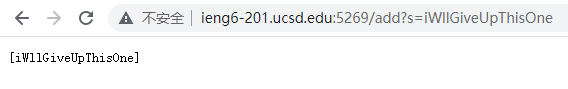

# Part1

**My search engine code:**
`SearchEngineServer.java`

    import java.io.IOException;
    import java.net.URI;
    import java.util.ArrayList;
    
    class Handler implements URLHandler {
        // The one bit of state on the server: a number that will be manipulated by
        // various requests.
        int num = 0;
    	ArrayList<String> searchList = new ArrayList<>();
        public String handleRequest(URI url) {
            if (url.getPath().equals("/")) {
                return String.format("Number: %d", num);
            } else if (url.getPath().equals("/increment")) {
                num += 1;
                return String.format("Number incremented!");
            } else{
                System.out.println("Path: " + url.getPath());
    			if (url.getPath().contains("/add")) {
                    String[] parameters = url.getQuery().split("=");
                    if (parameters[0].equals("count")) {
                        num += Integer.parseInt(parameters[1]);
                        return String.format("Number increased by %s! It's now %d", parameters[1], num);
                    }
    				if (parameters[0].equals("s")) {
    					//Add the string paramenters[1] to array
    					searchList.add(parameters[1]);
    					return searchList.toString();
    				}
                }
    			if (url.getPath().contains("/search")){
    				// For the search part
    				String[] parameters = url.getQuery().split("=");
    				if (parameters[0].equals("s")) {
    					//Add the string paramenters[1] to array
    					ArrayList<String> newList = new ArrayList<>();
    					for(String str: searchList){
    						if (str.contains(parameters[1])){
    							newList.add(str);
    						}
    					}
    				return newList.toString();
    				}
    			}
                return "404 Not Found!";
            }
        }
    }
    
    class SearchEngineServer {
        public static void main(String[] args) throws IOException {
            if(args.length == 0){
                System.out.println("Missing port number! Try any number between 1024 to 49151");
                return;
            }
    
            int port = Integer.parseInt(args[0]);
    
            Server.start(port, new Handler());
        }
    }

**Screenshot**

---

# Part2

**The two bugs I choose is:**
- A bug in `reversed` method from `ArrayExample.java`
- A bug in `ListExamples` method from `ListExamples.java`
 
### recersed method

**The failed test input Code:**

    @Test
      public void testReversed_1() {
        int[] input1 = { 3, 2, 1 };
        assertArrayEquals(new int[]{ 1, 2, 3 }, ArrayExamples.reversed(input1));
      }
      
    @Test
      public void testReversed_2() {
        int[] input1 = { 1 };
        assertArrayEquals(new int[]{ 1 }, ArrayExamples.reversed(input1));  
      }

**The input:** `{3, 2, 1}` `{1}`

**The expected output:** `{1, 2, 3}` `{1}`

**The Symptom output code:**

    1) testReversed_1(ArrayTests)
    arrays first differed at element [0]; expected:<1> but was:<0>
    
    2) testReversed_2(ArrayTests)
    arrays first differed at element [0]; expected:<1> but was:<0>

**The symptom (actual output):** `{0, 0, 0}` `{0}`

**Old method with bug:**

      static int[] reversed(int[] arr) {
        int[] newArray = new int[arr.length];
        for(int i = 0; i < arr.length; i += 1) {
          arr[i] = newArray[arr.length - i - 1];
        }
        return arr;
      }

**New method fixed bug:**

*Replaced the position of `arr` and `newArray` in the code.*

      //New metod fixed bug:
      static int[] reversed(int[] arr) {
        int[] newArray = new int[arr.length];
        for(int i = 0; i < arr.length; i += 1) {
          newArray[i] = arr[arr.length - i - 1];
        }
        return newArray;
      }

**The test result after fix bug:**

    JUnit version 4.13.2
    ....
    Time: 0.01
    
    OK (4 tests)

**The connection between the symptom and the bug：**

The old method, after passing the array `arr` into the method, creates a new array `newArray`, and tries to use a for loop to flip the elements of the array `arr` and copy it into `newArray`. However, in the actual code, `arr[i] = newArray[arr.length - i - 1]` incorrectly copies the value of the empty array `newArray` into the array `arr`, so that the elements in `arr` are all become 0. Then the method returns `arr`, which is why the symptom shows us that the array elements are all 0 in the result.

### filter method

**The failed test input Code:**
*explain: this test should return anarray that have all elements with a char `c` in it, with the same order in input array.*

    class StrChecker implements StringChecker{
        @Override
        public boolean checkString(String s){
            if(s.contains("c"))
                return true;
            return false;
        }
    }
    
    public class ListTests{
      @Test
      public void testListFiltr_1() {
        List<String> input1 = new ArrayList<>();
        input1.add("aaa");
        input1.add("bbb");
        input1.add("ccc");
        input1.add("abc");
        input1.add("cde");
    
        List<String> result = new ArrayList<>();
        result.add("ccc");
        result.add("abc");
        result.add("cde");
        StringChecker sc = new StrChecker();
        assertEquals(result, ListExamples.filter(input1, sc));
      }

**The input:** `{aaa, bbb, ccc, abc, cde}`

**The expected output:** `{ccc, abc, cde}`

**The Symptom output code:**

    1) testListFiltr_1(ListTests)
    java.lang.AssertionError: expected:<[ccc, abc, cde]> but was:<[cde, abc, ccc]>

**The symptom (actual output):** `{cde, abc, ccc}`

**Old method with bug:**

    static List<String> filter(List<String> list, StringChecker sc) {
        List<String> result = new ArrayList<>();
        for(String s: list) {
          if(sc.checkString(s)) {
            result.add(0, s);
          }
        }
        return result;
      }

**New method fixed bug:**

*change `result.add(0, s);` to `result.add(s);`*

    static List<String> filter(List<String> list, StringChecker sc) {
        List<String> result = new ArrayList<>();
        for(String s: list) {
          if(sc.checkString(s)) {
            result.add(s);
          }
        }
        return result;
      }

**The test result after fix bug:**

    JUnit version 4.13.2
    .
    Time: 0.009
    
    OK (1 test)

**The connection between the symptom and the bug：**

The old method, after passing the array `list` and StringChecker `sc` into it, will create a new array `result` to hold the filtered array. If an element in the array passes the `sc` check, then that element is pushed into the array `result`. However, in practice, `result.add(0, s);` incorrectly adds new elements all the way to the beginning of the array `result`, causing the elements in `result` to be in the reverse order of the original array. Therefore, after change `result.add(0, s);` to `result.add(s);`, the method will push the new element to the end of `result`, ensuring its order is the same as the original array.

